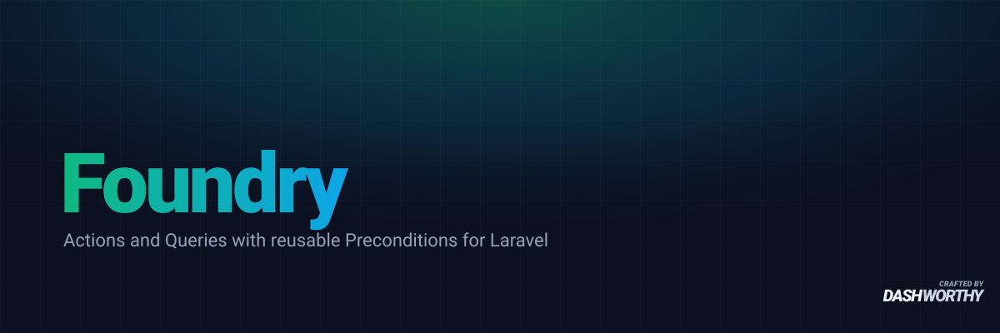

<p align="center">
    <a href="https://packagist.org/packages/dashworthy/foundry"></a>
    <a href="https://packagist.org/packages/dashworthy/foundry"></a>
    <a href="https://packagist.org/packages/dashworthy/foundry"></a>
    <a href="https://github.com/dashworthy/foundry/actions"></a>
    <a href="https://packagist.org/packages/dashworthy/foundry"></a>
</p>

Single-argument actions and queries with reusable preconditions and owned transactions for Laravel, plus domain-aware generators.

## The four pieces

Foundry models a write as an `Action` and a read as a `Query`. Each takes exactly one `Data` object and is gated by the same reusable `Precondition` pipes. The base classes own the plumbing: an `Action` runs `handle()` inside a database transaction and calls `rollback()` on failure; a `Query` runs the builder `handle()` returns and hands back a `Collection`.

| Piece | Namespace | Shape |
| --- | --- | --- |
| `Data` | `Dashworthy\Foundry\Data` | `abstract readonly class Data` — the one argument every unit takes |
| `Precondition` | `Dashworthy\Foundry\Preconditions` | `interface` with `handle(Data $data, Closure $next): mixed` |
| `Action` | `Dashworthy\Foundry\Actions` | `abstract class Action` — write side, owns the transaction |
| `Query` | `Dashworthy\Foundry\Queries` | `abstract class Query` — read side, no transaction |

## Installation

You can install the package via Composer:

```bash
composer require dashworthy/foundry
```

## Usage

### Defining data

Every unit takes a single argument: a `final readonly` class extending `Data`. `Data` is a `readonly` base, so a subclass is `readonly` too.

```php
use Dashworthy\Foundry\Data\Data;
use Illuminate\Contracts\Auth\Authenticatable;

final readonly class PublishPostData extends Data
{
    public function __construct(
        public Authenticatable $user,
        public Post $post,
    ) {}
}
```

### Defining an action

Extend `Action`, list preconditions cheapest/most-restrictive first, and implement `handle()`. `handle()` runs inside a database transaction by default.

```php
use Dashworthy\Foundry\Actions\Action;

/**
 * Not `final`: subclassing or mocking in tests needs to reach in without
 * fighting the class declaration.
 *
 * @extends Action<PublishPostData, Post>
 */
class PublishPost extends Action
{
    protected function preconditions(): array
    {
        return [
            new ActorOwnsPost,
            new PostHasContent,
        ];
    }

    protected function handle(PublishPostData $data): Post
    {
        $data->post->update(['published_at' => now()]);

        return $data->post;
    }
}
```

`handle()` takes your own `{Name}Data`, not the `Data` base. `Action` gets that by declaring `handle()` as a `@method` annotation rather than a real abstract method: PHP forbids narrowing a parameter type in an override, so a real `abstract protected function handle(Data $data)` would fatal any subclass that named its actual data class. The trade is that an action which never declares `handle()` fails on its first `execute()` rather than at class-declaration time — worth asserting in an architecture test over your own units:

```php
it('has every action declaring handle()', function () {
    // ...reflect over your Action subclasses and assert hasMethod('handle')
});
```

PHPStan reads the action's return type from the second `@extends Action<{Name}Data, …>` argument, not from the `handle()` signature — keep the two in step.

### Preconditions

A precondition is one rule checked before an `Action` or a `Query` runs, and the same rule can gate both sides. It implements `Precondition` and runs as a pipe in a Laravel [`Illuminate\Pipeline\Pipeline`](https://laravel.com/docs/helpers#pipeline) — the same chain-of-responsibility convention Laravel's own HTTP middleware uses. `handle()` receives the `Data` and the next pipe: call `$next($data)` to let the chain continue, or throw to refuse. The exception is whatever the application wants — this package doesn't ship one and doesn't wrap it.

Because a precondition is shared across the write and read sides, it types on the base `Data` and narrows inside — with an `instanceof`, or against a contract your application layers onto its own `Data` classes.

```php
use Closure;
use Dashworthy\Foundry\Data\Data;
use Dashworthy\Foundry\Preconditions\Precondition;

final class ActorOwnsPost implements Precondition
{
    public function handle(Data $data, Closure $next): mixed
    {
        if (! $data instanceof PublishPostData) {
            throw new InvalidArgumentException('ActorOwnsPost expects PublishPostData.');
        }

        if ($data->post->user_id !== $data->user->getAuthIdentifier()) {
            throw new NotPostOwner('You do not own this post.');
        }

        return $next($data);
    }
}
```

`preconditions()` returns a list of pipe instances, or class-strings the Pipeline resolves from the container:

```php
protected function preconditions(): array
{
    return [
        new ActorOwnsPost,
        PostHasContent::class, // resolved from the container when the chain runs
    ];
}
```

### Running an action

Resolve the unit from the container with `make()` (or `run()` for `make()` + `execute()` in one call). Prefer these to `new` so a bound decorator or fake is honoured.

```php
$post = PublishPost::run(new PublishPostData($user, $post));
// or, to hold the instance:
$post = PublishPost::make()->execute(new PublishPostData($user, $post));
```

`execute()` always does the same two things, in order, with no way for a subclass to reorder them: assert preconditions, then run `handle()` inside a transaction. Preconditions run in declaration order and the chain stops at the first that throws — whatever exception it throws propagates unchanged, before `handle()` ever runs.

The package does not dispatch events for you. If a side effect must not fire until the work commits, use Laravel's own tools: `ShouldQueueAfterCommit` on the notification or job, or a `DB::afterCommit()` call from inside `handle()`.

To ask whether an action would be allowed — for deciding whether a control renders — without running it:

```php
if (PublishPost::make()->permits($data)) {
    // show the "Publish" button
}
```

`permits()` runs the precondition chain and returns `false` if anything throws, `true` otherwise. It never runs `handle()`.

### Defining and running a query

A `Query` is the read-side twin of an `Action`: same `make()`/`run()`/`permits()`/`fake()` helpers and the same precondition pipeline, minus the transaction. `handle()` *builds* the read and returns the Eloquent builder; the base asserts the preconditions, runs `->get()`, and returns the rows. A concrete query never runs the builder itself.

```php
use Dashworthy\Foundry\Queries\Query;
use Illuminate\Database\Eloquent\Builder;

/**
 * @extends Query<PendingInvitationsData, TeamInvitation>
 */
class PendingInvitations extends Query
{
    /**
     * @return Builder<TeamInvitation>
     */
    protected function handle(PendingInvitationsData $data): Builder
    {
        return TeamInvitation::query()
            ->whereRaw('LOWER(email) = ?', [$data->email])
            ->whereNull('accepted_at')
            ->latest();
    }
}

$invitations = PendingInvitations::run(new PendingInvitationsData($email)); // Collection<int, TeamInvitation>
```

Keep the query about *which rows*: shaping them into whatever a page, export, or API needs is the caller's job.

### Handling refusals

There is nothing to configure. A precondition throws whatever exception the application defines — a domain exception, a Laravel `AuthorizationException`, anything — and `assert()`/`execute()`/`get()`/`permits()` never touch it beyond letting it propagate (or, for `permits()`, catching it to answer `false`). Catch it wherever that decision belongs — typically the app's own exception handler:

```php
->withExceptions(function (Exceptions $exceptions) {
    $exceptions->render(function (NotPostOwner $e, Request $request) {
        return back()->withErrors(['action' => $e->getMessage()]);
    });
})
```

### Rolling back on failure

The transaction already undoes any database writes when `handle()` throws. It cannot undo anything else `handle()` did — an external charge, a third-party API call. Override `rollback()` for that:

```php
/**
 * @extends Action<ChargeCardData, Charge>
 */
class ChargeCard extends Action
{
    private ?string $chargeId = null;

    protected function handle(ChargeCardData $data): Charge
    {
        $charge = $this->gateway->charge($data->amount);
        $this->chargeId = $charge->id;

        // ... more work that might throw ...

        return $charge;
    }

    protected function rollback(): void
    {
        if ($this->chargeId !== null) {
            $this->gateway->refund($this->chargeId);
        }
    }
}
```

`rollback()` takes no arguments — unlike `handle()` it has a body to override, so narrowing a data type on it is the thing PHP forbids. Capture whatever the rollback needs, the data included, as an instance property during `handle()`.

`rollback()` runs only when `handle()` throws — never for a refused precondition, since nothing has happened yet to undo. If `rollback()` itself throws, that's reported and swallowed; the exception that caused the rollback is always what propagates.

### Deliberate opt-outs

Both live on the call, not the class, and both should be rare.

- `withoutTransaction()` drops the database transaction for one call. Reach for it only when `handle()` calls an external service mid-flight, or when a caught constraint violation must not abort a surrounding transaction: `PublishPost::make()->withoutTransaction()->execute($data)`.
- `withoutPreconditions()` skips the precondition gate for one call — the mirror of `withoutTransaction()`. **Treat it as a red flag, not a convenience.** Preconditions are where a unit's authorization and state rules live, so skipping them in a request flow is a security bug. It exists only for a trusted caller that has already enforced the rules itself — a migration, a seeder, a maintenance command running as no one.

### Calling a unit from inside a transaction

Nesting `execute()` inside a caller-managed transaction is supported — a plain `DB::transaction()`, another action's `handle()`, whatever:

```php
DB::transaction(function () use ($data) {
    PublishPost::run($data); // runs normally
});
```

The action's own `DB::transaction()` call becomes a savepoint inside the caller's, exactly as you'd expect. `execute()` doesn't need to own the outermost transaction, so there's no guard here and nothing to restructure the caller around.

### Generators

```bash
php artisan make:action PublishPost          # also scaffolds PublishPostData
php artisan make:query PendingInvitations     # also scaffolds PendingInvitationsData
php artisan make:data SomeSharedData          # a Data class on its own
php artisan make:precondition ActorOwnsPost
```

`make:action` and `make:query` scaffold the matching `{Name}Data` and wire it into the `@extends` annotation. Use `make:data` alone only when a `Data` class must exist without a matching unit. All the generators are domain-aware: pass `--domain` / `--subdomain` to place files under `app/Domains/…`, and they layer the same placement onto Laravel's own `make:*` generators.

Folder placement is driven by `config/foundry.php`. Publish it to customise the domain base directory and per-type subdirectories:

```bash
php artisan vendor:publish --tag=foundry-config
```

## Changelog

Please see [CHANGELOG](CHANGELOG.md) for more information on what has changed recently.

## Contributing

Thank you for considering contributing to Foundry! Please review our [contributing guide](.github/CONTRIBUTING.md) to get started.

## Credits

- [Andrew Leach](https://github.com/dashworthy)
- [All Contributors](../../contributors)

## License

Foundry is open-sourced software licensed under the [MIT license](LICENSE.md).
